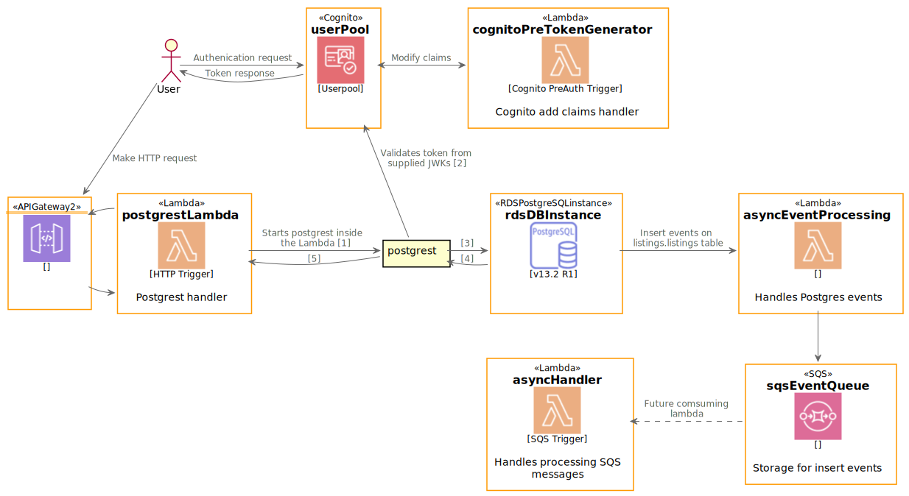

# resumatic

Resumes that wins bids, or CVs ¯\_(ツ)\_/¯

## Project

This project is constructed used AWS native and managed services. They are
deployed using the [Serverless Framework](https://www.serverless.com/). The
current deployment creates the following architecture diagram. There are a few
resources such as IAM Role, policies and security groups that are not
represented on this diagram.



## Usage

CLI tools and scripts use the AWS SDK and CLI. Access Keys, secrets and regions
will need to be configured prior to running any of the tools or deploying agents.

### Environment Variables

We recommend using [Direnv](https://direnv.net/) for managing environment
variables. A stage which serverless consumes is also used in the utility
commands as well. For an example environment configuration see below.

```shell
export STAGE=dev
export DB_PORT=5432
export DB_NAME=postgres
export DB_USERNAME=test
export DB_PASSWORD=password-to-change
export DB_SCHEMA=listings
export DB_ANON_ROLE=anon
export AWS_REGION=ap-southeast-2
# For login: (Sean's Ids)
export REACT_APP_AWS_REGION="ap-southeast-2"
export REACT_APP_COGNITO_IDENTITY_ID="unused"
export REACT_APP_COGNITO_USER_POOL_ID="ap-southeast-2_9y53D9NEU"
export REACT_APP_COGNITO_WEB_CLIENT_ID="3340vaq49dc2d9alrn77k6gaa"
```

These variables can also be passed in as command-line arguments to Serverless, e.g.

```shell
npm run sls deploy -- -s some_stage --DB_PORT 1234 --DB_PASSWORD aBetterPassword
```

### Deploying

YOU NEED NODE 14

To deploy everything, run:

```shell
npm install
cd cli-tools
npm install
npm run build
cd ..
npm run sls deploy -- -s $STAGE
```

### Testing

You will need to generate a user. From can be done from a command line tool from
the root directory.

```shell
./tools add-user --username <Username> --password <Password> --email <Email> --role <standard/admin>
```

The user will need to have either standard or admin for the role types. These are
what align with the postgres roles.

To get a token from that user to use with the api requests use the command line
tool.

```shell
./tools get-token --username <Username> --password <Password>
```

To change the role a user has in cognito use the following command.

```shell
./tools change-user-role --username <Username> --role <standard/admin>
```

### Postgrest Config

Internally, the lambda handler generates a PostgREST configuration. If you want
to test outside the AWS lambda environment, the generated configuration needs to -
at a minimum - have the following data:

```
db-uri = "postgres://<DB_USERNAME>:<DB_PASSWORD>@<HOST>:<DB_PORT>/<DB_NAME>"
db-schema = "<DB_SCHEMA>"
db-anon-role = "<DB_ANON_ROLE>"
```

Note the double quotes around string variables; these are important. For the
full list of configuration variables you can set, see the
[PostgREST documentation](https://postgrest.org/en/latest/configuration.html).

### Utility Commands

Some commands are available to make background tasks easier.

See [Commands Readme](cli-tools/README.md) for how to use them.
